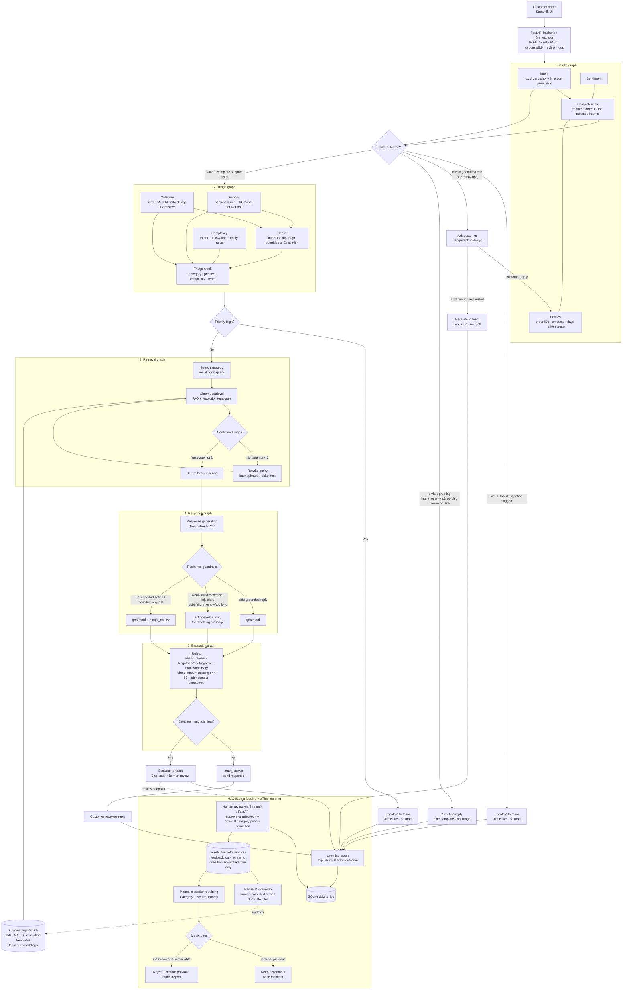

# TicketFlow-AI

TicketFlow-AI is a multi-agent customer-support platform that combines LLMs, machine learning, retrieval-augmented generation, and human-in-the-loop escalation to automate customer-support ticket handling.

A support ticket enters through a Streamlit UI and FastAPI backend, then passes through an **Intake graph**, an optional **Triage graph**, **Retrieval**, **Response**, and **Escalation**. Terminal outcomes are logged by the Learning graph. Human-reviewed feedback can later be used to update the knowledge base or retrain the Category/Priority models.

All evaluation uses held-out test tickets, and the retrieval index is built from the training split only. The limits of each measurement are stated below.

> **Architecture note:** the project has **nine logical agent components** (Intake, Category, Priority, Team, Triage aggregator, Retrieval, Response, Escalation, Learning), implemented across **six LangGraph graphs**. Category/Priority/Team/Triage aggregator are nodes inside the single Triage graph; they are not four separate LangGraph graphs.

## Architecture

The online serving path is:

1. **Streamlit → FastAPI**
2. **Intake**
   - intent classification + injection pre-check
   - sentiment
   - entity extraction
   - completeness check
3. Intake branches:
   - `intent_failed` / `flagged_injection` → Jira escalation, **no draft**
   - missing required information → customer follow-up interrupt; maximum two follow-ups, then Jira escalation
   - trivial/greeting → fixed greeting response, **no Triage**
   - valid and complete support ticket → Triage
4. **Triage**
   - Category, Priority and Complexity are computed
   - Team is assigned after Category and Priority; High priority overrides the normal team and becomes `Escalation`
5. **High priority**
   - Jira escalation immediately, **Retrieval and Response are skipped**
6. **Retrieval**
   - searches FAQ and resolution-template channels in Chroma
   - if confidence is low, rewrites the query and retries once
7. **Response**
   - grounded LLM draft when retrieval is high-confidence
   - otherwise returns a fixed `acknowledge_only` message and marks the result for review
   - response guardrails flag unsupported action claims and sensitive-information requests
8. **Escalation**
   - auto-resolve only when none of the escalation rules fire
   - otherwise creates a Jira issue with the draft and routes to human review
9. **Learning**
   - logs terminal outcomes to SQLite
   - human review updates the log and writes verified feedback
   - KB re-indexing and classifier retraining are **manual/offline scripts**, not automatic per-ticket actions



## What the online pipeline actually does

### Intake

The Intake graph runs:

- intent classification using an LLM with a pre-check for prompt-injection-style instructions aimed at the classifier;
- sentiment classification;
- regex/entity extraction for order IDs, amounts, elapsed days, product mentions, and unresolved prior contact;
- completeness checking.

For intents that require an order lookup, a missing order ID causes a LangGraph `interrupt()`. The API returns `awaiting_customer`; a later `POST /process/{ticket_id}` resumes the same checkpoint. There are at most **two follow-up rounds**. After that, the ticket is handed to a human.

`intent_failed`, `flagged_injection`, and the follow-up-exhausted `escalate_to_human` status all bypass Triage/Retrieval/Response and create a Jira issue with **no draft reply**.

### Trivial / greeting shortcut

After Intake, the orchestrator checks for a trivial message only when the predicted intent is `other`.

A message is treated as trivial when it is a known greeting/test/acknowledgement phrase such as `hi`, `hello`, `thanks`, `ok`, or when it is at most three words long.

This path:

- skips Triage;
- skips Retrieval;
- skips the Response LLM;
- returns a fixed greeting template;
- does not create Jira;
- is logged as `no_action_needed`.

### Triage

The Triage graph has four logical components:

| Component | Implementation |
|---|---|
| Category | Classifier over frozen `all-MiniLM-L6-v2` embeddings |
| Priority | Rule for four deterministic sentiment values; XGBoost only for Neutral |
| Complexity | Rule score from intent, follow-up rounds, elapsed days, number of order IDs/amounts |
| Team | Intent-to-team lookup; High priority overrides the normal team |

Category, Priority and Complexity start in parallel. Team waits for Category and Priority; the Triage result is then returned to the orchestrator.

There are **seven normal operational teams** plus the `Escalation` override.

### Early High-priority escalation

If Priority is `High`, the orchestrator immediately creates a Jira issue and stops the pipeline.

No Retrieval and no Response agent runs, so there is **no generated draft** on this path.

### Retrieval

The Retrieval graph:

1. searches the Chroma `support_kb` using the original cleaned ticket text;
2. searches both `faq` and `resolution_template` channels with one query embedding;
3. grades confidence using source-specific distance thresholds;
4. retries once with an intent-augmented query if confidence is low.

`MAX_ATTEMPTS = 2`, so the maximum is one initial search plus one retry.

The base index contains:

- **150 FAQ documents**
- **62 deduplicated resolution-template documents**
- **212 documents total**

Human-reviewed replies added later with `index_from_feedback` increase this count (the evaluated index has 213 documents, with one such reply).

The resolution-template documents are derived from the **8,001-ticket training split only**. The held-out test tickets are not used to construct the index.

### Response

The Response graph behaves differently depending on retrieval:

- **High confidence:** call Groq `openai/gpt-oss-120b` with the retrieved FAQ/resolution evidence.
- **Low confidence, no documents, or retrieval error:** return a fixed `acknowledge_only` message and set `response_needs_review=True`.
- **LLM failure, empty output, or excessive length:** use the same holding-message fallback and require review (the evaluation logs record LLM failures as `response_mode=failed`).
- **Unsupported action claims or sensitive-information requests:** keep the generated text but mark it for human review.

The Response prompt instructs the model to use only the retrieved evidence. This is a **prompting/guardrail strategy, not a formal claim-level citation verifier**. The evaluation below shows why that distinction matters.

A grounded reply whose strongest evidence is a `resolution_template` is also marked for review because that source is weaker than an FAQ policy hit.

### Escalation

The post-response Escalation graph escalates if **any** of these conditions holds:

- `response_needs_review=True`;
- sentiment is `Negative` or `Very Negative`;
- complexity is `High`;
- refund intent has no stated amount;
- refund amount is above **50** (the threshold has no currency in the code; the dataset's amounts are in rupees);
- prior contact is marked unresolved.

If none fires, the result is `auto_resolve`.

Jira creation is part of the escalation path. If the escalation decision logic itself errors, it fails safe to `escalate_to_team`.

## Learning and human feedback

The runtime **Learning graph only logs the completed ticket outcome** to SQLite and writes auto-resolved outcomes to the feedback CSV.

It does **not** automatically re-index Chroma or retrain models after every ticket.

Human review is performed in the Streamlit UI and submitted through:

```text
POST /ticket/{ticket_id}/review
```

The review can:

- approve the draft;
- reject/edit the draft;
- optionally correct Category;
- optionally correct Priority.

Verified labels are written to `data/processed/tickets_for_retraining.csv`.

### Knowledge-base update

`src.learning.index_from_feedback` is a **manual** process. It can add human-reviewed replies to Chroma after applying its duplicate/FAQ filtering rules.

Example:

```bash
python -m src.learning.index_from_feedback --apply --exclude <ticket ids that duplicate FAQ answers>
```

### Classifier retraining

`src.learning.retrain_from_feedback` is also **manual**.

It:

1. loads only human-verified labels;
2. merges them with the base training set in memory;
3. never modifies `support_tickets_train.csv`;
4. retrains Category and/or Neutral-Priority;
5. evaluates the new model on the fixed test set;
6. keeps the new model only if its metric is not worse;
7. otherwise restores the previous model/report.

Commands:

```bash
python -m src.learning.retrain_from_feedback --category
python -m src.learning.retrain_from_feedback --priority
python -m src.learning.retrain_from_feedback --both
python -m src.learning.retrain_from_feedback --both --dry-run
```

For Priority retraining, only verified **Neutral** examples are used because the other sentiment classes map deterministically to priority in the current dataset.

## Results at a glance

All results below are from held-out test tickets. Sample sizes are small because the free tiers of the LLM providers limited what could be run (Groq: 200,000 tokens per day; Gemini: 20 chat requests per day).

- **Automation:** 39.2% (38/97 completed tickets), 95% CI 30.1%–49.1%; the 50% target was not reached.
- **Escalations:** 59/97 completed tickets.
  - 44 High-priority early escalations
  - 12 `response_needs_review`
  - 3 `refund_amount_unstated`
- **Escalation vs the historical label:** recall 97.1%, precision 57.6% (F1 72.3%).
- **Category accuracy:** 100% on the 97-ticket end-to-end sample.
- **Priority accuracy:** 92.8% on the same 97-ticket sample.
- **Latency:** mean 2.7 s; median 1.7 s, including LLM calls.
- **Response grounding:** the LLM judge (5 replies) found unsupported claims in 3, each where the knowledge base had no entry for the customer's problem. A manual review of 11 auto-resolved replies found them on topic, with one detail stretched beyond its source. Evidence sufficiency is the main open problem.

### How the end-to-end sample was run

100 random held-out test tickets (fixed seed). 97 completed; 3 asked a follow-up question and are excluded from the rates. Tickets that failed on a first pass because of a provider token limit or a transient error were re-run, so no failure-driven escalations are in these figures. Jira was disabled during the run.

The 44 High-priority cases are 45.4% of the completed sample and establish a policy-driven ceiling on automation unless that rule is changed. The rule was not tuned to meet the 50% target.

### Escalation vs historical label

The runtime system never sees the dataset's historical `escalated` field. In the test split, 33.8% of tickets carry that flag, and it occurs only on High-priority tickets (71.9% of them; 0% of Low and Medium).

On the 97 completed tickets:

| | auto_resolve | escalate_to_team |
|---|---:|---:|
| not escalated | 37 | 25 |
| escalated | 1 | 34 |

- Precision: **57.6%** (95% CI 44.9%–69.4%)
- Recall: **97.1%** (95% CI 85.5%–99.5%)
- F1: **72.3%**

The high-priority rule alone gives 75.0% precision and 94.3% recall in this sample. The additional review/refund rules deliberately trade precision for a more conservative human-handoff policy: they escalate 15 tickets, of which one was historically escalated. The single missed escalation was a sentiment boundary error (Negative read as Slightly Negative, giving Medium priority).

## Retrieval evaluation

| Check | Result |
|---|---:|
| Resolution-template Recall@10 / MRR, 20 gold queries | **0.50 / 0.1728** |
| Resolution-template Recall@10 / MRR, 40 gold queries | **0.375 / 0.14** |
| FAQ Recall@1 / Recall@10, 5 gold queries | **1.00 / 1.00** |
| Full-agent resolution-template Recall@1 (20 queries) | **0.05 (1/20)** |
| Full-agent resolution-template MRR (20 queries) | **0.0725** |
| Full-agent FAQ Recall@1 | **1.00 (5/5)** |
| Off-topic false-high rate | **0/10** |

The resolution-template benchmark is noisy because the synthetic ticket-to-resolution labels do not always describe the actual ticket. Correctly useful retrieval can therefore count as a labelled miss. For example, an "OTP not received" ticket is labelled with "Blocked account reviewed", while retrieval returned "OTP delivery fixed. Mobile number updated successfully", which counts as a miss. The FAQ set, where the ground truth is clean, is a better signal, but it has only five queries.

The template distance ranges also overlap substantially between correct and incorrect top-1 results, so the current `high` confidence label is not a reliable measure of evidence correctness for resolution templates.

## Response evaluation

### BLEU / ROUGE

On 100 held-out test tickets (fixed seed):

- BLEU: **0.0026**
- ROUGE-1 F1: **0.0598**
- ROUGE-L F1: **0.0512**

After excluding exact duplicate resolution texts (n=33):

- BLEU: **0.0022**
- ROUGE-1 F1: **0.0462**
- ROUGE-L F1: **0.0400**

A near-duplicate-excluded subset is not reported: only 12 of the 1,999 test tickets are not near-duplicates.

These are secondary metrics because the reference `resolution_text` is an internal short note, while the generated output is customer-facing prose.

### LLM-as-judge

Five held-out replies were scored by a Gemini judge from a different model family:

| Metric | Mean | Score ≥ 4 |
|---|---:|---:|
| Grounded | 3.00 / 5 | 40% |
| Relevant | 4.40 / 5 | 80% |
| No over-promise | 4.60 / 5 | 80% |

All three criteria were ≥4 for **2/5** replies. The free-tier limit of 20 requests per day restricted the sample, so no rate is claimed.

Three replies received grounding scores ≤3. I read those three against their retrieved documents. Of the six claims the judge flagged, five were genuinely unsupported and one was a wording nitpick. The common failure mode was that the KB lacked an entry for the customer's exact problem (an invalid return label, store credit not applying, a failed net-banking payment), while the Response model supplied a plausible procedure anyway.

This is the clearest evidence that **retrieval confidence alone is not an evidence-sufficiency guarantee**.

### Manual review of auto-resolved replies

In the first end-to-end batch, 11 auto-resolved replies were read by hand. All 11 were grounded with high retrieval confidence and on topic. Five details that did not come straight from FAQ text were checked against the indexed documents, and all five were found. A sixth sentence stretched its source: a GST reply said a corrected invoice is generated automatically after the GSTIN is updated, which the FAQ does not say. Three replies had missing spaces (for example "delayedwith").

### Human review log

The development log contains **22 human review decisions**:

- 9 approved as-is
- 13 rejected/corrected

These are not a random quality sample. They are repeated/development inputs that had already escalated and were reviewed by the developer. They describe the human-review workflow rather than overall response quality.

## Classification evaluation

### Category

The standalone Category evaluation on the full held-out test set (1,999 tickets) reports:

- Macro F1: **0.9949**

The end-to-end 97-ticket sample produced 100% exact category agreement with the held-out labels.

### Priority

The final Priority design is hybrid:

- Positive → Low
- Slightly Negative → Medium
- Negative → High
- Very Negative → High
- Neutral → trained binary classifier

On the full 1,999-ticket test set:

- overall accuracy: **97.05%**
- macro F1: **0.9529**
- Neutral classifier accuracy: **88.52%**
- rule-based non-Neutral accuracy: **100%**

The final Neutral classifier is XGBoost because it beat Logistic Regression on Neutral macro F1.

The end-to-end priority accuracy (92.8%) was measured on a different, smaller sample (97 tickets), and it uses the pipeline's own predicted sentiment.

## Data

The project uses:

- 10,000 synthetic support tickets
- 8,001 training tickets
- 1,999 held-out test tickets
- 150 FAQ entries

The retrieval preprocessing deduplicates the training-ticket resolution text down to **62 resolution-template documents**, producing a 212-document KB before any later human-feedback additions.

Resolution text is heavily templated, so retrieval and text-generation metrics must be interpreted in that context.

## Known limitations

- **Evidence sufficiency is not formally verified.** A high retrieval confidence label does not guarantee that the retrieved documents actually answer the customer's question. Retrieval confidence was `high` on all 100 tickets in the response evaluation.
- **Resolution-template confidence is particularly weak.** Correct and incorrect distances overlap.
- **The Escalation agent does not use classifier confidence or retrieval confidence directly.** Retrieval source/confidence influences `response_needs_review`, which then influences escalation.
- **The Response model can hallucinate plausible procedures when the KB lacks the needed policy.** The current system falls back only when retrieval is low-confidence, not when the evidence is semantically insufficient.
- **The 50% automation target is not met.** The High-priority policy alone creates a substantial automation ceiling (about 55%).
- **Sentiment is noisy.** The five-class held-out sentiment accuracy is only 43.22%, although the operational Negative/Very Negative grouping reaches 91.40%.
- **Samples are small.** The LLM judge uses five replies, BLEU/ROUGE 100 tickets, and the end-to-end evaluation 97 completed tickets.
- **BLEU/ROUGE are weak proxies** for this task because the reference is an internal resolution note, and the template-retrieval results depend on noisy synthetic labels.
- **Generation varies between runs.** The same 20 tickets gave ROUGE-1 0.060 and 0.063 on two runs.
- **Some cleaned text contains spacing artifacts**, and the Response normalizer only fixes a subset of whitespace/punctuation cases.
- **Team assignment is a domain rule, not a learned/evaluated label.** The dataset has no ground-truth team column.
- **Jira is disabled in the batch evaluation.** The evaluation measures the decision path without creating external Jira issues.

## API

The FastAPI application exposes:

| Endpoint | Purpose |
|---|---|
| `POST /ticket` | Create a new ticket and run the online pipeline |
| `POST /process/{ticket_id}` | Resume an `awaiting_customer` ticket with the customer's reply |
| `GET /ticket/{ticket_id}` | Return the latest in-memory state or durable SQLite record |
| `GET /logs/{ticket_id}` | Return the Learning/SQLite log row |
| `POST /ticket/{ticket_id}/review` | Save human approval/edit and optional Category/Priority corrections |

A ticket waiting for customer input is held in the LangGraph checkpoint and is not written to the terminal-ticket log until it reaches a terminal path.

## Project structure

```text
src/
  orchestrator.py                 chains the graphs and controls routing
  api/main.py                     FastAPI wrapper
  intake/                         intent, sentiment, entities, completeness
  triage/                         category, priority, complexity, team
  retrieval/                      query, Chroma retrieval, confidence, evaluation
  response/                       grounded response generation + evaluation
  escalation/                     escalation rules + Jira integration
  learning/                       SQLite logging + manual feedback/retraining tools
  guardrails.py                   prompt/sensitive-information/output checks
  preprocessing.py                dataset cleaning and train/test split

app.py                            Streamlit UI

data/
  raw/                            source datasets
  processed/                      cleaned data, split data, RAG documents, feedback
  eval/                           batch evaluation results

models/                           trained classifiers
chroma_db/                        persistent Chroma vector store
reports/                          evaluation reports
tests/                            rule tests

dvc.yaml                          data preprocessing pipeline
params.yaml                       configuration
pyproject.toml                    dependencies/project metadata
```

## Setup

Configuration lives in `.env` and should not be committed.

Required external configuration:

```text
GROQ_API_KEY
GEMINI_API_KEY

JIRA_URL
JIRA_EMAIL
JIRA_API_TOKEN
JIRA_PROJECT_KEY
```

The Jira variables are only required when Jira escalation is enabled.

## Build the processed data and retrieval index

The DVC preprocessing stage creates the cleaned train/test files:

```bash
dvc repro
```

Or run the preprocessing script directly:

```bash
python src/preprocessing.py
```

Build the retrieval documents from the training split:

```bash
python -m src.retrieval.preprocessing_rag
python -m src.retrieval.retrieval_document --reset
```

This creates the base 212-document index: 150 FAQ entries plus 62 deduplicated resolution templates. The indexing script pauses between embedding batches to respect the Gemini free-tier limit of 100 requests per minute.

Apply human-reviewed KB feedback only when intentionally updating the index:

```bash
python -m src.learning.index_from_feedback --apply --exclude <ticket ids that duplicate FAQ answers>
```

## Run the application

Start FastAPI:

```bash
uvicorn src.api.main:app --host 127.0.0.1 --port 8000
```

Then start Streamlit:

```bash
streamlit run app.py
```

The Streamlit app talks to FastAPI over HTTP.

## Reproduce evaluations

Retrieval:

```bash
python -m src.retrieval.retrieval_eval --sample-size 40
python -m src.retrieval.retrieval_eval --sample-size 20 --agent   # run after a minute's wait: the agent costs up to 2 embedding calls per query
```

Full end-to-end batch:

```bash
python -m src.evaluation.batch_eval --n 100 --sleep 15
```

Response metrics:

```bash
python -m src.response.response_eval --sample-size 100 --sleep 5
python -m src.response.response_judge --n 5 --sleep 13
```

Evaluation scripts write results incrementally and support `--resume` where implemented.

## Design philosophy

TicketFlow-AI deliberately favors conservative automation:

- fail safe to a human when intent classification fails;
- fail safe when injection is detected;
- ask for missing required information rather than guessing;
- route High-priority tickets before generating a reply;
- require review for weak retrieval evidence and potentially unsafe response claims;
- keep the retrieval corpus separated from the held-out test set;
- train from human-verified feedback rather than treating automatic predictions as ground truth;
- reject a retrained model when its fixed-test metric regresses.

The main unresolved research problem is **evidence sufficiency**: the system can detect weak retrieval by distance, but it does not yet reliably determine whether the retrieved evidence actually answers the customer's question. That is the most important area for a future version.